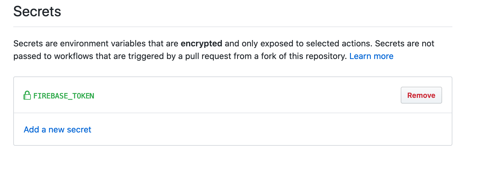

# Github actions integration

## Deploy Firebase Hosting

Add an action and secrets for the Action to run!



### Example

Action configuration file:



You will also need to configure secrets in the settings -&gt; secrets space in your repository.

### Links



