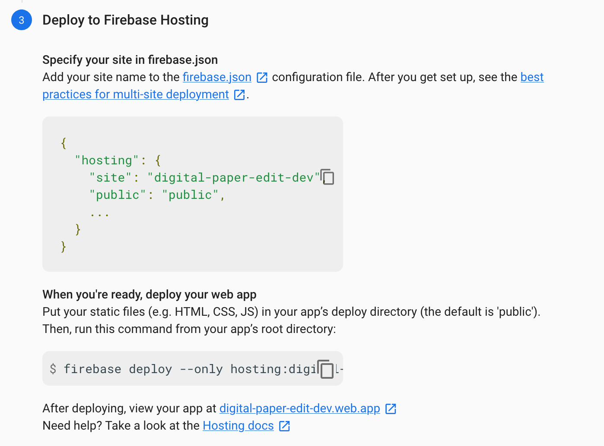

# Deploying To Firebase Hosting

We are almost ready to deploy our react app to Firebase hosting. First we need to add a line to firebase.json to automatically build our application before deploying. Otherwise you will forget to do it. Add the following line to the hosting section:

```javascript
"predeploy": ["npm --prefix \"$RESOURCE_DIR/..\" run build"]
```

In context

```javascript
{
  "functions": {
    "predeploy": ["npm --prefix \"$RESOURCE_DIR/..\" run build"]
  },
  "hosting": {
    "public": "build", 
    "predeploy": ["npm --prefix \"$RESOURCE_DIR/..\" run build"]
    "ignore": [
      "firebase.json",
      "**/.*",
      "**/node_modules/**",
      "**/functions/**",
      "**/public/**"
    ],
    "rewrites": [
      {
        "source": "**",
        "destination": "/index.html"
      }
    ]
  }
}
```

Now we can deploy:

```bash
firebase deploy
```

React will build and a link will be provided in the console. You should be able to click on that link your React application will load!

## Restricted to one "project" setup with multiple apps?

If your company doesn't allow you to create as many projects as possible \(cost is mostly the reason why\), you want to setup Apps as a way to create your host.

You can add multiple domains via the UI.

Once you've done that you should add hosting configuration to your `firebase.json` file and add the deployment step to `package.json`.



```javascript
// firebase.json
{
  "hosting": {
    "site": "<site-name>",
    ...
  }
}

// package.json
{
  "scripts": {
    "deploy:hosting": "firebase deploy --only hosting:<site_name>",
    ...
  }
}
```

To further simplify your life you can also aliasing the project name:

```bash
$ firebase use --add                                                                                 ✔  17:37:51 
> ? Which project do you want to add? <environment-specific-project-name>
> ? What alias do you want to use for this project? (e.g. staging) <environment-alias>

> Created alias dev for <environment-specific-project-name>.
> Now using alias dev (<environment-specific-project-name>)
                                                                              ✔  17:39:09 
$ firebase deploy -P <environment-alias>
```



The multisite feature supports a maximum of **36 sites per Firebase project**.

## A complete example of the Firebase JSON with hosting only

[https://firebase.google.com/docs/hosting/full-config\#firebase-json\_example](https://firebase.google.com/docs/hosting/full-config#firebase-json_example)

