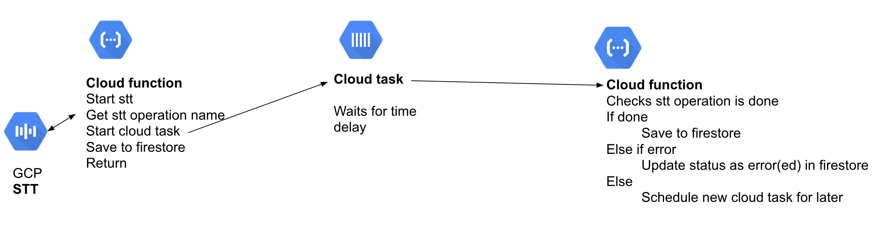

# Example implementation

## High level overview

You'd need 2 cloud function, one \(`createTranscript`\)to start the recognition, and trigger a cloud task that on a time delay triggers the second one \(`firestoreCheckSTT`\)to check the progress of the transcription gcp operation. If the transcript is not done, it triggers another cloud task to re-trigger the second cloud task later.

## Cloud Function `createTranscript`

* [ ] Create audio that meets GCP STT Specs  \(eg `ogg` or `wav`.`ffmpeg` bin present on GCP Cloud function by default\)
* [ ]  Call Google Cloud STT long running recognition
* [ ] Get operation name in response 
* [ ] Start cloud task \(eg on a 5 min delay\)
  * [ ] in cloud task payload have
    * operation name
    * firestore path to the audio file
  * [ ] cloud task end point for cloud function to check STT `firestoreCheckSTT`
  * [ ] add ENV for firebase to be able to call GCP STT opration
* [ ] save to firestorm 
  * operation name
  * status 'in-progress'
* [ ] return 

## Cloud function to check if operation is done `firestoreCheckSTT`

* [ ] end point for GCP operation
* [ ] GET request to check GCP operation end point    
  * [ ] if done 
    * [ ] save data
  * [ ] if not done
    * [ ] trigger another cloud task operation 
    * same payload
  * [ ] if errors 
    * [ ] save data to firestore

missing handling edge cases, eg If the transcript has been deleted, should try to save in the cloud task, it should drop it Eg instead of set / merge should be try catch, with a method for update only if it exists

